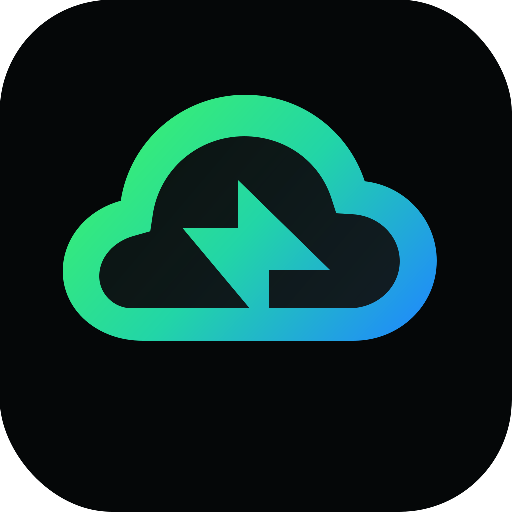

<p align="center">
  
</p>

<h1 align="center">CTX</h1>

<p align="center">
  <strong>A lightweight, native macOS Cloud Context Switcher</strong>
</p>

<p align="center">
  
  
  
</p>

CTX resides directly in your macOS Menu Bar, providing a native, lightweight, and fast experience to authenticate, verify, and switch between multiple cloud profiles. Fully supports **AWS SSO**, **Google Cloud Platform (GCP)**, and **Kubernetes (K8s)**.

Designed for developers and DevOps engineers who manage complex multi-account environments and need a seamless, keyboard-friendly way to swap contexts.

---

## Key Features 🚀

- **Native macOS Experience:** Built using Swift and SwiftUI, styled with clean layouts and smooth transitions that align with macOS system design.
- **Multi-Cloud & Kubernetes Support:** Switch between AWS profiles, GCP configurations, and Kubernetes (K8s) contexts concurrently.
- **Menu Bar & Sidebar Interface:** Access all profiles via a compact dropdown in the system status bar, or open the detailed sidebar interface.
- **Robust Path & CLI Resolution:** Directly locates Homebrew-installed binaries (`aws`, `gcloud`) and operates correctly even when launched through macOS LaunchServices.
- **Single-Instance Reopening:** Correctly reactivates the active window when double-clicking the Dock/desktop icon instead of creating duplicate processes.
- **Dynamic Folders:** Group profiles into environments (e.g. *Production*, *Staging*, *Admin*). Toggle folder expansion by clicking anywhere on the folder row.
- **Complete Folder Control:** Delete built-in or custom folders easily from the UI to keep your workspace decluttered.
- **Secure Credentials Handling:** Exports and writes temporary AWS STS credentials and switches active gcloud configurations safely without storing static secrets.
- **Session Expiration Alerts:** Monitors local AWS token caches and pops up system alerts or banners when your active session is about to expire.
- **Seamless Auto-Updates:** Automatically monitors for new releases from GitHub in the background, posts system notifications when an update is available, and installs updates in a single click—downloading, extracting, replacing the app bundle, and restarting the app natively without manual steps.

---

## Installation 🛠️

To install CTX to your `/Applications` folder using a single terminal command:

### Option 1: Homebrew Cask (Recommended)
Add the tap and install the Cask:
```bash
brew install --cask eliasaf-abargel/tap/ctx
```

### Option 2: Standard Installation Script
```bash
curl -fsSL https://raw.githubusercontent.com/eliasaf-abargel/CTX/main/script/install.sh | bash
```

---

## Development 💻

### Prerequisites
- macOS 14.0+
- Xcode 15.0+ or Swift 6.0+
- AWS CLI (`aws`) and Google Cloud SDK (`gcloud`) installed (e.g. via Homebrew)

### Run in Development
To build, sign, and launch the application in development:
```bash
./script/build_and_run.sh run
```

Other modes:
- `./script/build_and_run.sh logs` — Opens the app and starts streaming system logs.
- `./script/build_and_run.sh verify` — Verifies the app is running.

### Run Verification Tests
```bash
swift build
swift run CTXCoreTests
swift run CTXCheck
./script/build_and_run.sh verify
```

### Kubernetes Workspace

The Kubernetes foundation keeps cluster context data in dedicated domain models
instead of overloading generic cloud profile fields. See
[docs/kubernetes-foundation.md](docs/kubernetes-foundation.md) for the original
service boundaries. The current Cluster Workspace is documented in
[KUBERNETES_WORKSPACE.md](KUBERNETES_WORKSPACE.md).

The workspace uses real Kubernetes inspection data through explicit
`kubectl --context` commands while keeping startup lightweight. Opening the
workspace loads cluster identity, namespaces, API reachability, and RBAC
`can-i` summaries (checked concurrently, not one at a time). Resource screens
lazy-load namespaces, nodes, workloads, pods, services, ingress, configmaps
metadata, secrets metadata, and events, with an in-memory cache scoped to the
open cluster window — nothing is written to disk. Logs (bounded, inspection pod
tail), inspection YAML (as a sheet from the resource inspector), Exports
(JSON/CSV via the native save panel), and Diff (cached-vs-live comparison) are
also live. Namespace selection is local to CTX and never changes global
kubectl config. Mutation actions remain absent, and secret values are never
read or displayed.

### Cluster Workspace Diagnostics

When the Overview reports an error, compare CTX with the same inspection command
in Terminal:

```bash
KUBECONFIG=/path/from/ctx kubectl --context <context-from-ctx> get namespaces -o json
kubectl --context <context-from-ctx> get nodes -o json
kubectl --context <context-from-ctx> auth can-i list pods -A
```

If CTX reports a local proxy or tunnel refusal, start the VPN, SDM/Teleport
proxy, Rancher Desktop tunnel, or other access tool backing that kubeconfig
context, then refresh the Overview.

The workspace uses 15 second default reads and 22 second heavy reads for
all-namespaces pods/events — tuned to fail fast with a clear per-resource
error rather than leave a screen spinning. If kubectl returns valid JSON after
a slow response,
CTX parses the data instead of showing raw command output. Normal UI errors show
a short reason, retry, copy diagnostics, and optional details; raw stdout is not
rendered in the main panel. Selecting a resource opens an inspection detail
dashboard. YAML viewing is for inspection and disabled for resources that can expose
secret or configuration values.

### Project Guidance

- [AGENTS.md](AGENTS.md): rules for AI coding agents.
- [SECURITY.md](SECURITY.md): security, diagnostics, and Kubernetes safety.
- [DESIGN_SYSTEM.md](DESIGN_SYSTEM.md): native macOS design direction.
- [KUBERNETES_WORKSPACE.md](KUBERNETES_WORKSPACE.md): workspace behavior.
- [ROADMAP.md](ROADMAP.md): future product direction.
- [CONTRIBUTING.md](CONTRIBUTING.md): contributor expectations.

---

## Security & Privacy 🔒

- **Local & Private:** CTX does not store, transmit, or share your credentials or profiles. All operations happen entirely offline on your local machine.
- **No Secrets Committed:** Configs, token caches, and active credentials remain safe within your home directory (`~/.aws/` and `~/.config/gcloud/`) and are excluded from Git.
- **Automatic Backups:** Backup files are created locally during changes and are excluded from Git.
- **Ad-hoc Signing:** The local build script signs the application bundle ad-hoc. For distribution outside your Mac, compile with a valid Developer ID certificate.

---

## Contact & Support 📬

Developed by **Eliasaf Abargel**  
Email: [eliasafabargel@gmail.com](mailto:eliasafabargel@gmail.com)
